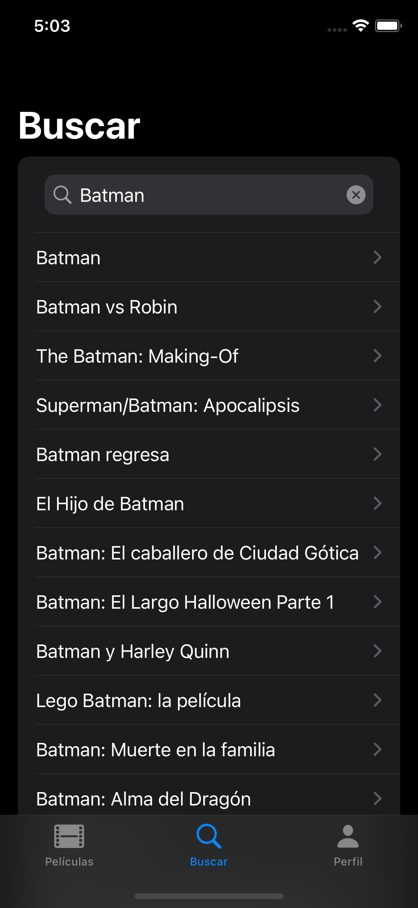

# TMDB SwiftUI / MVVM / Async-Await

This iOS app provides information of movies with [TMDB API](https://developers.themoviedb.org/3/getting-started/introduction)  like top rated movies or trending movies. You can sign in with your account and add your movies as favorite.

It's was developed with Swift and SwiftUI working on iOS 14+.

## Features:

* 100% Swift
* Async/await API
* MVVM design pattern and dependency injection
* HTTP, JSON and REST API
* Offline mode
* Authentication with ASWebAuthenticationSession
* Internet detection
* Error handling 

## Frameworks
* SwiftUI
* CoreData
* AuthenticationServices
* Network
* Security (Keychain)

## Screenshots

|  |  |  |  |
| ------------------------------------------------------------ | ------------------------------------------------------------ | ------------------------------------------------------------ | ------------------------------------------------------------ |
|  |  |  |  |
|  |  |  |                                                              |

## Instructions

1) Clone the repo
2) Add your API key to the `EndPoint.swift` file
3) Compile and run on Xcode 13.2 or above

